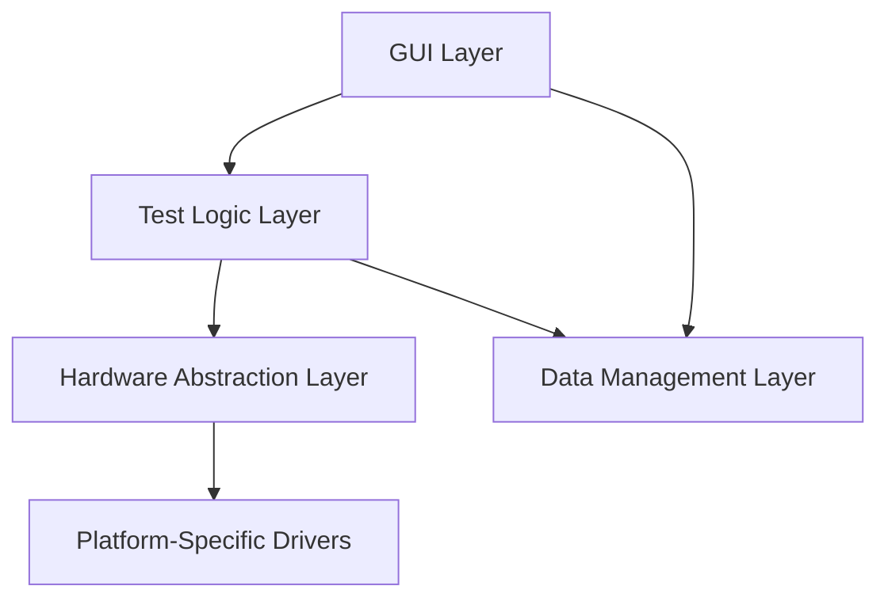

# Test Bench GUI

**Comprehensive validation platform for tendon-driven robotic hand systems**

---

## Overview

This is a professional test bench control system for validating tendon-driven finger mechanisms. Designed for precision testing with the Maxon ECX TORQUE 22 L motor and GPX 22 HP gearbox (231:1 reduction), targeting 5-6 kg static hold force.

## Key Features

- **Platform-Agnostic Architecture** - Supports Teensy 4.1, IMX8, Raspberry Pi, and simulation modes
- **5 Automated Test Protocols** - Torque, Hysteresis, Stiffness, Static Hold, and Endurance testing
- **Real-Time Visualization** - Live plotting at 50-100 Hz sample rates
- **Comprehensive Data Management** - Session-based organization with CSV/JSON export
- **Multi-Layer Safety System** - Hardware, firmware, and software protection

## Quick Links

-   :material-rocket-launch:{ .lg .middle } __Getting Started__

    ---

    Install dependencies and run your first test in 30 minutes

    [:octicons-arrow-right-24: Quick Start](getting-started/quick-start.md)

-   :material-book-open-variant:{ .lg .middle } __Tutorial__

    ---

    Step-by-step guide for using the test bench GUI

    [:octicons-arrow-right-24: Tutorial](user-guide/tutorial.md)

-   :material-math-compass:{ .lg .middle } __Engineering Theory__

    ---

    Mathematical foundations and validation methodology

    [:octicons-arrow-right-24: Theory](technical/theory.md)

-   :material-code-braces:{ .lg .middle } __Platform Guide__

    ---

    Developer guide for porting to new hardware platforms

    [:octicons-arrow-right-24: Platform Guide](technical/platform-guide.md)

## System Highlights

| Feature | Specification |
|---------|--------------|
| **Hardware Platforms** | 4 (Teensy, IMX8, RPi, Mock) |
| **Automated Tests** | 5 validation protocols |
| **GUI Tabs** | 7 functional interfaces |
| **Data Rate** | 50-100 Hz real-time |
| **Target Force** | 5-6 kg static hold |

## Architecture

The system uses a clean **4-layer modular architecture**:

## Status

- ✅ Phase 7 Complete - Platform abstraction and GUI
- ✅ Multi-platform support (4 platforms)
- ✅ Comprehensive test protocols (5 automated tests)
- ✅ Real-time data visualization
- ✅ Production-ready codebase

## Next Steps

Ready to get started? Check out the [Quick Start Guide](getting-started/quick-start.md) or dive into the [Tutorial](user-guide/tutorial.md).
